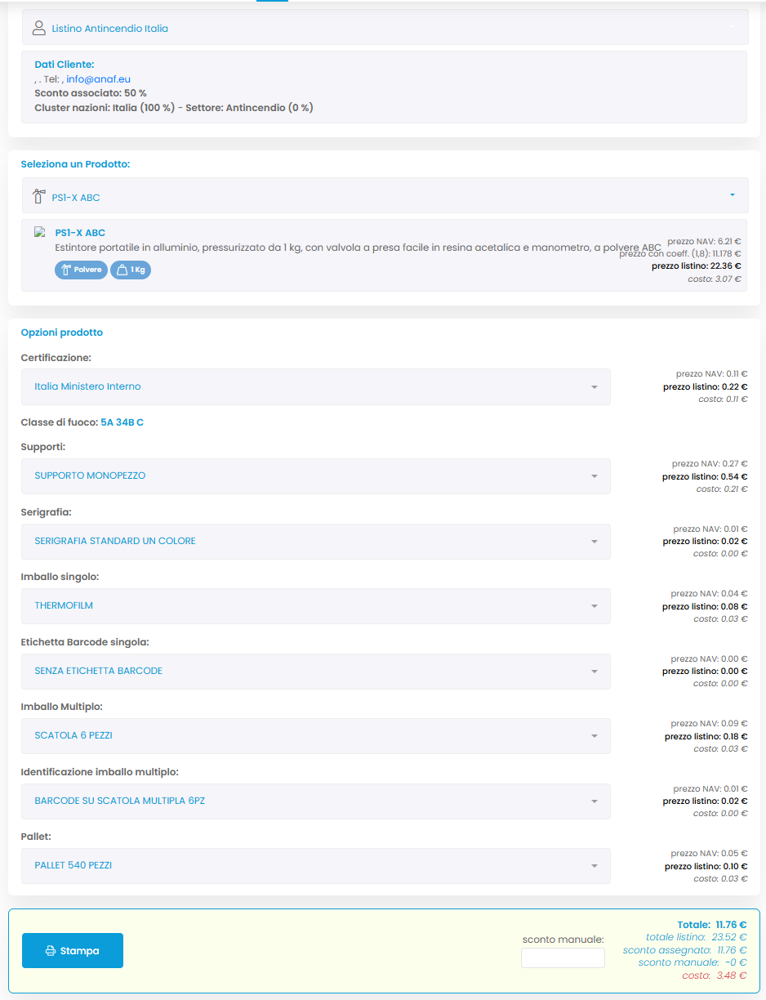
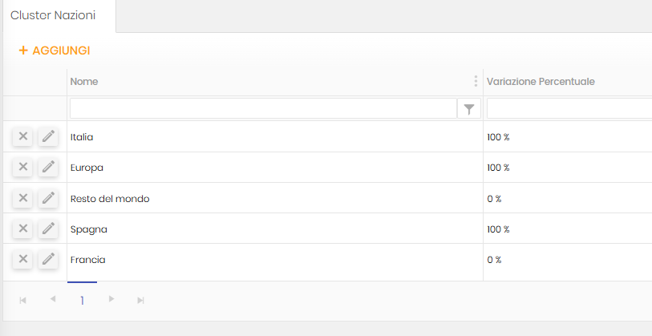
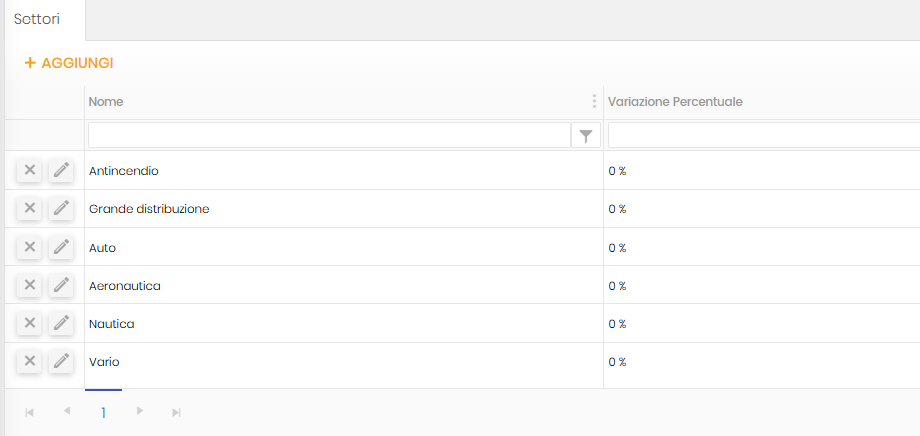
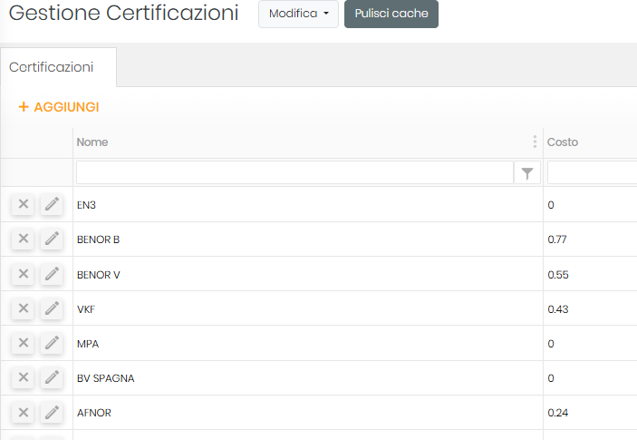
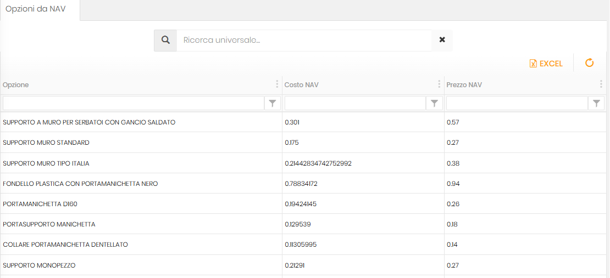
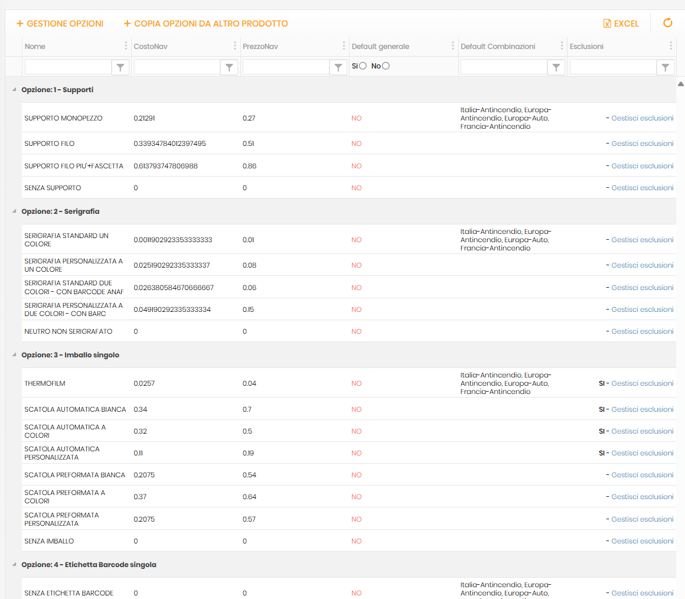
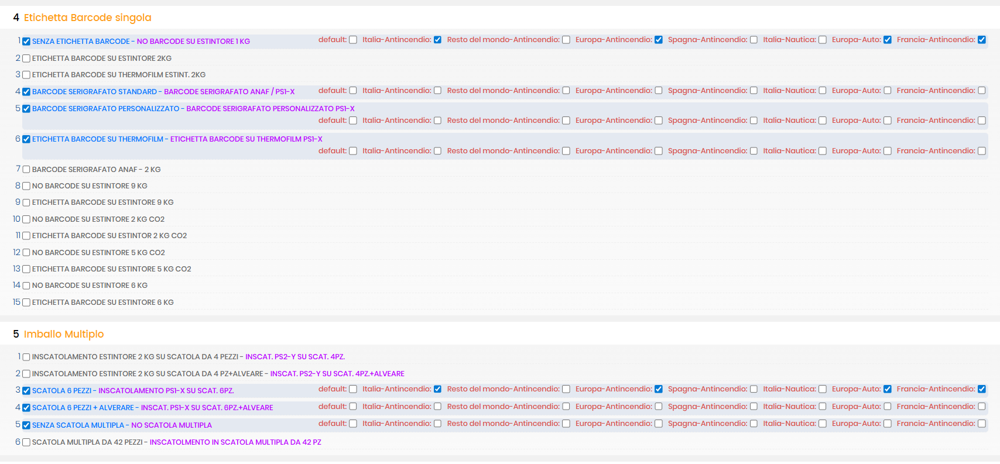
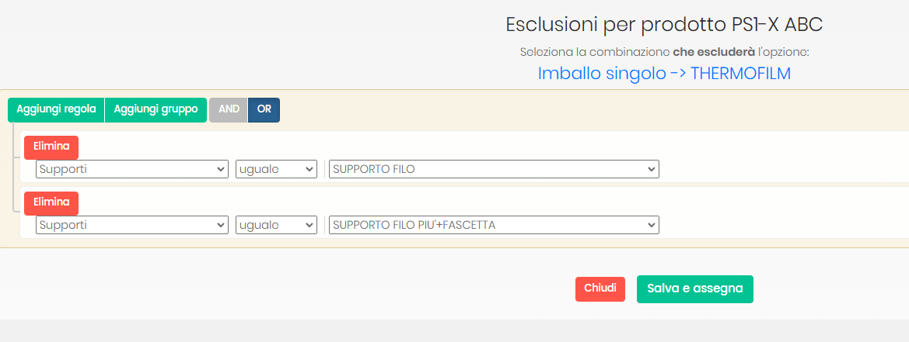
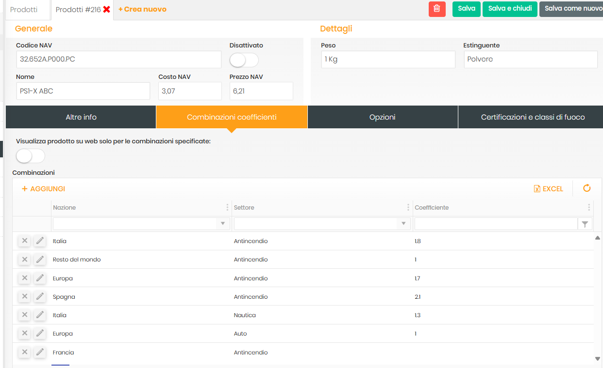

# Analisi Sistema Configuratore Estintori
## Documento di Analisi Business per Approvazione Manageriale

---

## Executive Summary

Il sistema configuratore estintori è una piattaforma web progettata per automatizzare e standardizzare il processo di creazione preventivi. L'obiettivo principale è trasformare un'attività complessa e potenzialmente soggetta a errori in un processo guidato, sicuro e commercialmente sostenibile.

Il sistema garantisce tre pilastri fondamentali:
- **Coerenza tecnica**: Ogni configurazione è automaticamente validata per compatibilità
- **Protezione dei margini**: Nessun preventivo può essere finalizzato con prezzi in perdita
- **Standardizzazione commerciale**: Tutte le politiche di prezzo e sconto sono applicate uniformemente

---

## Panoramica del Flusso Operativo

### Diagramma del Processo Principale

```
┌─────────────────┐    ┌─────────────────┐    ┌─────────────────┐    ┌─────────────────┐
│   SELEZIONE     │───▶│  CONFIGURAZIONE │───▶│   CALCOLO       │───▶│   CONTROLLO     │
│   CLIENTE       │    │   PRODOTTO      │    │   AUTOMATICO    │    │   MARGINE       │
└─────────────────┘    └─────────────────┘    └─────────────────┘    └─────────────────┘
         │                       │                       │                       │
         ▼                       ▼                       ▼                       ▼
  • Cluster geografico    • Modello estintore     • Prezzo base           • Validazione
  • Settore attività      • Certificazioni        • + Opzioni            • profittabilità
  • Sconti associati      • Accessori/Opzioni     • + Adeguamenti        • Approvazione
                          • Esclusioni automatiche • - Sconti cliente     • finale
```

### Flusso di Esclusioni e Compatibilità

```
SELEZIONE OPZIONE A
         │
         ▼
┌─────────────────┐
│ CONTROLLO       │──── Se incompatibile ────┐
│ COMPATIBILITÀ   │                           │
└─────────────────┘                           ▼
         │                            ┌─────────────────┐
         │                            │ DISABILITA      │
         ▼                            │ OPZIONI         │
┌─────────────────┐                   │ INCOMPATIBILI   │
│ AGGIORNA        │◀──────────────────┴─────────────────┘
│ INTERFACCIA     │
└─────────────────┘
```

### Interfaccia Utente del Sistema

Di seguito viene mostrata l'interfaccia reale del configuratore durante il processo di creazione di un preventivo:



*L'interfaccia mostra la selezione del cliente, la configurazione del prodotto con le relative opzioni, e il riepilogo finale con tutti i totali calcolati automaticamente.*

---

## Processo Dettagliato per Fasi

### Fase 1: Inquadramento Commerciale (Selezione Cliente)

**Obiettivo Business**: Personalizzare automaticamente l'offerta in base al profilo del cliente.

Quando l'operatore seleziona un cliente, il sistema carica immediatamente tutti i parametri commerciali associati. Questo non è semplicemente un'operazione anagrafica, ma l'attivazione di una strategia di prezzo specifica.

**Cosa succede automaticamente**:
- Il sistema identifica il cluster geografico del cliente (es. "Italia", "Europa", "Spagna", "Francia", "Resto del mondo")
- Determina il settore di attività (es. "Antincendio", "Grande distribuzione", "Auto", "Aeronautica", "Nautica", "Vario")
- Applica lo sconto cliente preconfigurato
- Carica le variazioni di prezzo per area geografica e settore

**Impatto Operativo**: L'operatore non deve ricordare o cercare manualmente le condizioni commerciali specifiche. Il sistema garantisce che ogni preventivo parta dal corretto posizionamento strategico, eliminando errori di listino e assicurando coerenza nelle politiche commerciali.

**Controllo di Qualità**: Solo clienti registrati nel sistema possono ricevere preventivi, garantendo tracciabilità e applicazione corretta delle condizioni contrattuali.

### Fase 2: Selezione e Filtro Prodotti

**Obiettivo Business**: Presentare solo prodotti effettivamente disponibili per il cliente specifico.

Il sistema non mostra semplicemente tutti i prodotti disponibili, ma filtra intelligentemente l'offerta. Alcuni prodotti potrebbero essere disponibili solo per mercati specifici o per clienti di determinate categorie.

**Logica Operativa**:
- Prodotti standard: Disponibili per tutti i clienti
- Prodotti con restrizioni: Visibili solo se esistono "combinazioni" specifiche per cluster geografico e settore del cliente
- Prodotti disattivati: Completamente nascosti dall'interfaccia

**Impatto Commerciale**: Questa filtrazione previene la creazione di offerte per prodotti non disponibili, eliminando potenziali problemi di fulfillment e garantendo che ogni preventivo sia effettivamente evadibile.

### Fase 3: Configurazione Guidata con Controllo Automatico

**Obiettivo Business**: Garantire coerenza tecnica e conformità normativa di ogni configurazione.

Questa è la fase più sofisticata del processo. Mentre l'operatore seleziona certificazioni e opzioni, il sistema monitora continuamente la compatibilità delle scelte effettuate.

**Esempio Pratico di Esclusione**:
Se l'operatore seleziona una certificazione per "ambienti marini", il sistema disabilita automaticamente opzioni incompatibili come supporti in acciaio non trattato. L'operatore non può nemmeno vedere o selezionare opzioni che renderebbero il prodotto non conforme.

**Meccanismo delle Regole**:
- Ogni combinazione di scelte viene verificata in tempo reale
- Le incompatibilità sono configurate centralmente nel sistema
- Nuove regole possono essere aggiunte senza modificare il software

**Valore Operativo**: Questo controllo elimina la possibilità di errori di configurazione, riducendo reclami post-vendita, costi di rilavorazione e rischi di non conformità normativa.

---

## Formula di Calcolo del Prezzo

### Schema del Calcolo Automatico

```
PREZZO BASE PRODOTTO + OPZIONI
         ↓
APPLICAZIONE COEFFICIENTE
(Specifico per Prodotto+Cluster+Settore SE ESISTE,
altrimenti Coefficiente Globale)
         ↓
PREZZO MOLTIPLICATO
         +
VARIAZIONI PERCENTUALI (Cluster + Settore)
         =
PREZZO LORDO CONFIGURAZIONE
         -
SCONTO CLIENTE AUTOMATICO
         -
SCONTO MANUALE (se autorizzato)
         =
PREZZO FINALE PROPOSTO
         ↓
CONTROLLO: Prezzo Finale ≥ Costo Totale?
         ↓
[SÌ] → PREVENTIVO APPROVATO
[NO] → BLOCCO O RICHIESTA AUTORIZZAZIONE
```

### Spiegazione dei Componenti di Prezzo

**Prezzo Base e Opzioni**: Ogni prodotto ha un prezzo di partenza. Ogni opzione selezionata aggiunge il proprio costo al totale.

**Adeguamenti Automatici**: Il sistema applica automaticamente maggiorazioni o riduzioni attraverso due livelli di coefficienti:
- **Coefficienti Globali**: Moltiplicatori base applicati a tutti i prodotti (es. coefficiente 1.5 su tutti i prezzi)
- **Coefficienti Specifici**: Moltiplicatori dedicati per combinazioni Prodotto+Cluster+Settore (es. coefficiente 1.8 per PSI-X ABC in Italia-Antincendio)
- **Variazioni Percentuali**: Adeguamenti aggiuntivi per cluster geografico e settore (es. Italia 100%, Europa 50%, tutti i settori attualmente 0%)

**Sconti Stratificati**:
- **Sconto Cliente**: Percentuale fissa associata al cliente, applicata automaticamente
- **Sconto Manuale**: Sconto aggiuntivo che l'operatore può inserire (entro limiti autorizzati)

**Controllo di Sostenibilità**: Il sistema calcola sempre il costo totale (prodotto + opzioni) e verifica che il prezzo finale garantisca un margine minimo. Questo controllo è invalicabile e protegge l'azienda da vendite in perdita.

---

## Sistema di Protezione dei Margini

### Logica di Controllo Redditivitività

Il sistema implementa una regola fondamentale: **nessun preventivo può essere finalizzato con un prezzo inferiore al costo totale**. Questo controllo avviene in tempo reale ad ogni modifica della configurazione.

**Scenari di Attivazione**:
- Accumulo di sconti eccessivi
- Selezione di opzioni ad alto costo con prezzo base basso
- Applicazione di sconti manuali troppo elevati

**Comportamento del Sistema**:
- **Prezzo ≥ Costo**: Configurazione procede normalmente
- **Prezzo < Costo**: Evidenziazione visiva dell'errore, blocco della finalizzazione

**Valore per il Business**: Questa funzionalità agisce come un "guardrail" automatico, impedendo errori costosi e proteggendo la redditivitità aziendale senza richiedere supervisione manuale continua.

---

## Configurazioni di Base del Sistema

Il sistema configuratore si basa su tabelle di configurazione che definiscono i parametri di calcolo e le regole di business. Queste configurazioni sono gestite centralmente e influenzano direttamente il comportamento del configuratore.

### Gestione Cluster Geografici



*La tabella Cluster Nazioni definisce i raggruppamenti geografici e le relative variazioni percentuali sui prezzi. Ogni cluster (Italia, Europa, Spagna, Francia, Resto del mondo) ha una specifica maggiorazione che viene applicata automaticamente ai prezzi base in funzione dell'area geografica del cliente.*

**Impatto Business**: Questa configurazione permette di implementare strategie di prezzo differenziate per area geografica, applicando automaticamente maggiorazioni per mercati specifici (es. Italia 100%, Europa 50%) o configurazioni base per altri mercati (es. Spagna, Francia, Resto del mondo con percentuali specifiche).

### Gestione Settori di Attività



*La tabella Settori classifica i clienti per tipologia di business (Antincendio, Grande distribuzione, Auto, Aeronautica, Nautica, Vario) con le relative variazioni percentuali. Attualmente tutti i settori sono configurati con 0% di variazione, indicando una politica di prezzo uniforme tra settori.*

**Significato Operativo**: Questa struttura consente di implementare facilmente politiche commerciali differenziate per settore. Attualmente tutti i settori (Antincendio, Grande distribuzione, Auto, Aeronautica, Nautica, Vario) sono configurati con 0% di variazione, indicando una politica di prezzo uniforme, ma la struttura permette di modificare facilmente queste percentuali per implementare strategie specifiche per settore.

### Catalogazione Certificazioni



*Il catalogo certificazioni mostra gli standard di qualità disponibili (EN3, BENOR B, BENOR V, VKF, MPA, BV SPAGNA, AFNOR) con i relativi costi aggiuntivi. Ogni certificazione ha un costo specifico che viene aggiunto al prezzo finale quando selezionata.*

**Controllo Qualità**: Le certificazioni non sono solo elementi di costo, ma determinano anche le compatibilità con le classi di fuoco e influenzano le opzioni disponibili attraverso il sistema di esclusioni automatiche.

### Catalogo Opzioni e Accessori



*La tabella delle opzioni mostra tutti gli accessori disponibili (supporti, fondelli, portamanichette, collari) con i rispettivi costi NAV e prezzi NAV. Questa è la base dati da cui il configuratore attinge per costruire le combinazioni possibili.*

**Gestione Pricing**: Ogni opzione ha un costo interno (Costo NAV) e un prezzo di vendita (Prezzo NAV). La differenza costituisce il margine base che viene poi modificato dai coefficienti geografici e settoriali.

### Associazioni Opzioni-Prodotto



*La schermata mostra la configurazione delle associazioni tra prodotti specifici e le opzioni disponibili. Per ogni gruppo di opzioni (Supporti, Serigrafia, Imballo singolo, Etichetta Barcode) vengono definiti i costi, prezzi, valori default e le combinazioni geografiche specifiche dove ogni opzione è disponibile.*

**Controllo Disponibilità**: Questa configurazione determina quali opzioni sono effettivamente selezionabili per ogni prodotto. Le colonne "Default Combinazioni" mostrano per quali mercati geografici (Italia-Antincendio, Europa-Antincendio, Francia-Antincendio) ogni opzione è disponibile, permettendo di personalizzare l'offerta per mercato.

**Gestione Esclusioni**: La colonna "Esclusioni" contiene i link alle regole di incompatibilità ("Gestisci esclusioni") che definiscono quando un'opzione deve essere automaticamente disabilitata in base ad altre selezioni. Questo sistema garantisce che vengano presentate solo configurazioni tecnicamente valide.

**Valore Operativo**: Questa matrice prodotto-opzioni è il cuore del sistema di configurazione. Permette di:
- Definire quali accessori sono compatibili con ogni modello
- Impostare prezzi e costi specifici per combinazione
- Gestire la disponibilità per mercato geografico
- Configurare le regole di esclusione automatica

#### Interfaccia di Configurazione Associazioni



*L'interfaccia di configurazione mostra come vengono definite nel dettaglio le associazioni tra prodotti e opzioni. Per ogni gruppo (Etichetta Barcode singola, Imballo Multiplo) viene presentata una lista completa delle opzioni disponibili con checkbox per selezionare quali sono compatibili con il prodotto specifico.*

**Granularità di Controllo**: Ogni opzione può essere configurata individualmente per ogni combinazione geografica e settoriale. Le checkbox colorate (Italia-Antincendio, Resto del mondo-Antincendio, Europa-Antincendio, Spagna-Antincendio, Italia-Nautica, Europa-Auto, Francia-Antincendio) permettono di definire con precisione millimetrica in quali mercati ogni singola opzione è disponibile.

**Processo Operativo**: Questa interfaccia consente agli amministratori di:
- Selezionare le opzioni compatibili per ogni prodotto (checkbox a sinistra)
- Definire i mercati di disponibilità per ogni opzione (checkbox colorate a destra)
- Impostare valori di default per facilitare la configurazione
- Gestire cataloghi diversificati per mercato senza duplicazioni

**Efficienza Gestionale**: Il sistema permette di configurare rapidamente centinaia di combinazioni prodotto-opzione-mercato attraverso un'interfaccia intuitiva, evitando la necessità di inserimenti manuali ripetitivi e riducendo drasticamente gli errori di configurazione.

#### Gestione Regole di Esclusione



*L'interfaccia di gestione esclusioni mostra come vengono create le regole di incompatibilità tra opzioni. Nell'esempio, per il prodotto PSI-X ABC viene configurata una regola che elimina automaticamente l'opzione "THERMOFILM" dal gruppo "Imballo singolo" quando vengono selezionati specifici tipi di supporto.*

**Logica delle Regole**: Il sistema permette di definire regole complesse utilizzando operatori logici AND/OR. Ogni regola può eliminare opzioni specifiche quando si verificano determinate condizioni. Nell'esempio mostrato:
- **Condizione**: Se nel gruppo "Supporti" viene selezionato "SUPPORTO FILO" o "SUPPORTO FILO PIU'+FASCETTA"
- **Azione**: Elimina automaticamente l'opzione "THERMOFILM" dal gruppo "Imballo singolo"
- **Operatore**: "uguale" per verificare la selezione specifica

**Controllo Qualità Automatico**: Queste regole garantiscono che vengano presentate solo configurazioni tecnicamente valide. Se un supporto specifico non è compatibile con un particolare tipo di imballo, il sistema impedisce automaticamente la selezione di combinazioni non realizzabili, eliminando errori di configurazione e problemi di produzione.

**Flessibilità Configurativa**: L'interfaccia permette di:
- Aggiungere multiple regole per lo stesso prodotto
- Combinare condizioni con operatori logici (AND/OR)
- Definire azioni di eliminazione granulari per gruppo e opzione specifica
- Gestire regole complesse senza necessità di programmazione

**Impatto Operativo**: Questo sistema di regole trasforma la conoscenza tecnica e le best practice aziendali in controlli automatici, garantendo che ogni preventivo generato sia non solo commercialmente sostenibile ma anche tecnicamente realizzabile.

### Combinazioni Specifiche Prodotto-Cliente



*La sezione "Combinazioni coefficienti" mostra come vengono gestiti i coefficienti specifici per combinazioni Prodotto+Nazione+Settore. Nell'esempio, per il prodotto PSI-X ABC vengono definiti coefficienti diversi a seconda del mercato di destinazione (Italia: 1.8, Europa: 1.7, Spagna: 2.1, ecc.).*

**Strategia Commerciale Avanzata**: Questa configurazione permette di applicare strategie di prezzo molto granulari, dove lo stesso prodotto può avere coefficienti moltiplicativi diversi in base alla combinazione di area geografica e settore del cliente specifico.

**Come Funzionano i Coefficienti nel Calcolo**:
I coefficienti sono moltiplicatori che vengono applicati al prezzo base (prodotto + opzioni) PRIMA dell'applicazione delle variazioni percentuali geografiche e settoriali. Questo significa che:

1. **Prezzo Base + Opzioni** → Subtotale iniziale
2. **× Coefficiente** → Prezzo moltiplicato (questo è il passaggio chiave)
3. **+ Variazioni % Cluster/Settore** → Prezzo finale listino

Il coefficiente trasforma quindi il prezzo base in un nuovo livello di prezzo, su cui poi si applicano gli adeguamenti percentuali per area geografica e settore.

### Logica di Priorità nelle Configurazioni

Il sistema applica le configurazioni seguendo una gerarchia precisa:

1. **Coefficienti Specifici**: Se esiste una combinazione Prodotto+Cluster+Settore nella tabella "Combinazioni coefficienti", questo coefficiente viene usato con priorità assoluta
2. **Coefficienti Globali**: In assenza di combinazioni specifiche, si applica il coefficiente generale dalla tabella "Coefficienti"
3. **Applicazione del Coefficiente**: Il coefficiente scelto moltiplica il subtotale (prodotto base + tutte le opzioni)
4. **Variazioni Percentuali**: Le variazioni geografiche e settoriali si sommano al prezzo già moltiplicato per il coefficiente
5. **Sconti Cliente**: Si applicano sul totale finale calcolato

**Ordine di Priorità per la Selezione del Coefficiente**:
- **PRIMA verifica**: Esiste coefficiente specifico per [Prodotto X + Cluster Y + Settore Z]?
- **SE SÌ**: Usa coefficiente specifico
- **SE NO**: Usa coefficiente globale di default

**Esempio Pratico con Coefficiente Specifico**:
- Prodotto PSI-X ABC per cliente italiano del settore Antincendio
- Prezzo base: €500
- Coefficiente specifico: 1.8 (dalla tabella combinazioni prodotto+cluster+settore)
- Prezzo dopo coefficiente: €500 × 1.8 = €900
- Variazione cluster Italia: 100% = €900
- Variazione settore Antincendio: 0% = €0
- Totale listino: €900 + €900 + €0 = €1.800
- Sconto cliente: variabile per cliente

**Esempio Pratico con Coefficiente Globale**:
- Prodotto generico per cliente francese del settore Nautica
- Prezzo base: €500
- Coefficiente globale: 1.5 (non esiste combinazione specifica)
- Prezzo dopo coefficiente: €500 × 1.5 = €750
- Variazione cluster Francia: secondo configurazione cluster = €X
- Variazione settore Nautica: 0% = €0
- Totale listino: €750 + €X + €0
- Sconto cliente: variabile per cliente

Questa stratificazione permette una gestione commerciale molto sofisticata mantenendo la semplicità operativa per l'utente finale.

---

## Output del Sistema e Riepilogo Finale

### Struttura del Preventivo Generato

Il sistema genera un riepilogo completo e trasparente che fornisce una visione dettagliata della composizione del prezzo finale. Questo riepilogo è fondamentale per la trasparenza commerciale e il controllo gestionale.

#### Visualizzazione dei Totali nell'Interfaccia

```
┌─────────────────────────────────────────────────────┐
│              RIEPILOGO PREVENTIVO                   │
├─────────────────────────────────────────────────────┤
│                                                     │
│  🔵 TOTALE FINALE:           €    22,34           │
│                                                     │
│     📋 Totale listino:       €    27,04           │
│     💰 Sconto assegnato:     €     2,70           │
│     ✂️  Sconto manuale:      €     2,00           │
│     ⚠️  Costo produzione:    €     4,21           │
│                                                     │
│  ✅ Margine garantito: € 18,13 (81,2%)            │
└─────────────────────────────────────────────────────┘
```

### Descrizione Dettagliata dei Totali

**1. Totale Finale (Prezzo di Vendita Effettivo)**
- **Significato**: Prezzo che verrà effettivamente fatturato al cliente
- **Calcolo**: Totale listino - Sconto assegnato - Sconto manuale
- **Controllo**: Deve sempre essere ≥ Costo produzione
- **Visualizzazione**: Evidenziato come valore principale del preventivo

**2. Totale Listino (Prezzo Prima degli Sconti)**
- **Significato**: Prezzo ufficiale secondo listino aziendale, comprensivo di tutti gli adeguamenti geografici e di settore
- **Calcolo**: Somma di (Prezzo base prodotto + Tutte le opzioni) con applicazione coefficienti cluster/settore
- **Utilizzo**: Base per calcolo margini e controllo politiche commerciali
- **Importanza**: Rappresenta il valore "pieno" della configurazione prima delle riduzioni commerciali

**3. Sconto Assegnato (Sconto Cliente Automatico)**
- **Significato**: Riduzione automatica applicata in base al profilo del cliente
- **Calcolo**: Totale listino × Percentuale sconto cliente
- **Caratteristica**: Applicato automaticamente dal sistema, non modificabile manualmente
- **Controllo**: Garantisce applicazione uniforme delle politiche cliente

**4. Sconto Manuale (Sconto Discrezionale)**
- **Significato**: Ulteriore riduzione che l'operatore può applicare discrezionalmente
- **Controllo**: Disponibile solo per utenti autorizzati
- **Modalità**: Può essere inserito come valore fisso (€) o percentuale (%)
- **Limitazioni**: Soggetto a controlli di margine minimo
- **Campo Input**: Presente nell'interfaccia con validazione in tempo reale

**5. Costo Produzione (Costo Interno)**
- **Significato**: Costo effettivo sostenuto dall'azienda per produrre l'estintore configurato
- **Calcolo**: Costo base prodotto + Somma costi di tutte le opzioni selezionate
- **Utilizzo**: Riferimento per controllo margine minimo
- **Visibilità**: Mostrato solo agli utenti autorizzati
- **Colore**: Evidenziato in rosso per distinguerlo dai prezzi di vendita

### Formula Completa di Generazione Totali

```
PASSO 1: Calcolo Totale Listino
═══════════════════════════════
Prezzo Base Prodotto PSI-X ABC    →  €     6,21
+ Opzione SUPPORTO MURO STANDARD  →  €     0,27
+ Certificazione BENOR B          →  €     0,77
+ Opzione PORTAMANICHETTA D100    →  €     0,26
                                     ──────────
Subtotale Base + Opzioni          →  €     7,51
× Coefficiente Specifico (1.8)    →  €    13,52
+ Variazione Cluster (100%)       →  €    13,52
+ Variazione Settore (0%)         →  €     0,00
                                     ──────────
TOTALE LISTINO                    →  €    27,04

PASSO 2: Calcolo Costo Produzione
═════════════════════════════════
Costo Base Prodotto PSI-X ABC     →  €     3,07
+ Costo SUPPORTO MURO STANDARD    →  €     0,175
+ Costo Certificazione BENOR B    →  €     0,77
+ Costo PORTAMANICHETTA D100      →  €     0,194
                                     ──────────
COSTO TOTALE                      →  €     4,21

PASSO 3: Applicazione Sconti
═══════════════════════════
Totale Listino                    →  €    27,04
- Sconto Cliente (10%)            →  €     2,70
                                     ──────────
Subtotale dopo sconto cliente     →  €    24,34
- Sconto Manuale                  →  €     2,00
                                     ──────────
TOTALE FINALE                     →  €    22,34

PASSO 4: Verifica Margine
════════════════════════
Totale Finale (€ 22,34) > Costo (€ 4,21) ✅
Margine: € 18,13 (81,2%)
```

### Controlli di Validazione dei Totali

**Controllo Margine Minimo**:
Il sistema verifica continuamente che `Totale Finale ≥ Costo Produzione`. Se questa condizione non è soddisfatta:
- L'interfaccia evidenzia l'errore con colorazione rossa
- I pulsanti di conferma/stampa vengono disabilitati
- Viene mostrato un messaggio di avvertimento visivo

**Controllo Coerenza Calcoli**:
- Tutti i valori vengono ricalcolati in tempo reale ad ogni modifica
- I totali sono sempre sincronizzati con le selezioni effettuate
- Eventuali incongruenze bloccano automaticamente il processo

**Gestione Arrotondamenti**:
- I prezzi sono visualizzati con 2 decimali per coerenza commerciale
- I calcoli interni mantengono precisione maggiore per evitare errori di arrotondamento
- L'arrotondamento finale garantisce presentazione professionale
